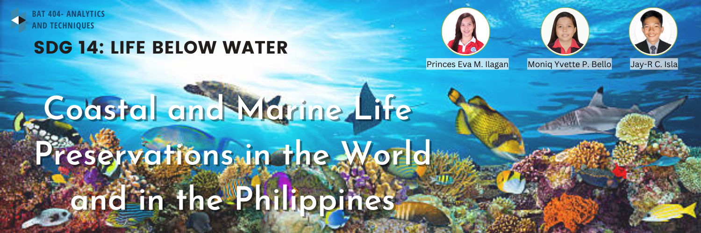
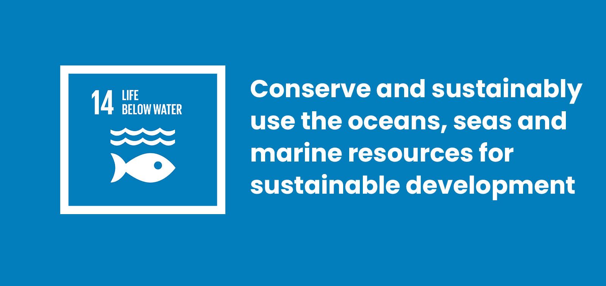
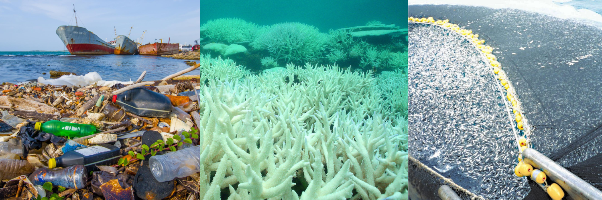
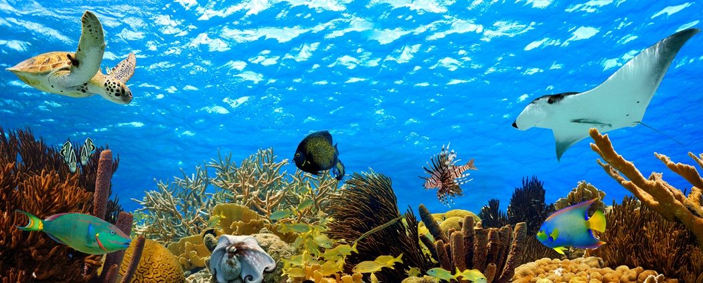

# Coastal and Marine Life Preservations in the World and in the Philippines

# Introduction

  The oceans are one of Earth's greatest gifts to humans, teeming with life and providing everything from fresh food to jobs for millions who would otherwise be unemployed. These waters on which we rely may appear to be in great health, yet not everything is as it appears.
Seeing marine animals in their natural habitat can be an exhilarating experience, such as seeing a pod of dolphins leap across the water, a sea turtle breeding on a beach, or a seal colony sunbathing in the sun.

  Marine conservation is also known as ocean conservation. The health of all life on Earth depends (directly or indirectly) on a healthy ocean. As humans began to realize their increasing impacts on the ocean, the field of marine conservation arose in response.

Sustainable Development Goals 14: "CONSERVE AND SUSTAINABLY USE THE OCEANS, SEAS AND MARINE RESOURCES FOR SUSTAINABLE DEVELOPMENT:

  The world’s oceans – their temperature, chemistry, currents and life – drive global systems that make the Earth habitable for humankind. How we manage this vital resource is essential for humanity as a whole, and to counterbalance the effects of climate change. Over three billion people depend on marine and coastal biodiversity for their livelihoods. However, today we are seeing 30 percent of the world’s fish stocks overexploited, reaching below the level at which they can produce sustainable yields. Oceans also absorb about 30 percent of the carbon dioxide produced by humans, and we are seeing a 26 percent rise in ocean acidification since the beginning of the industrial revolution. Marine pollution, an overwhelming majority of which comes from land-based sources, is reaching alarming levels, with an average of 13,000 pieces of plastic litter to be found on every square kilometre of ocean.

  The SDGs aim to sustainably manage and protect marine and coastal ecosystems from pollution, as well as address the impacts of ocean acidification. Enhancing conservation and the sustainable use of ocean-based resources through international law will also help mitigate some of the challenges facing our oceans. Healthy oceans and seas are essential to our existence.They cover 70 percent of our planet and we rely on them for food, energy and water. Yet, we have managed to do tremendous damage to these precious resources. We must protect them by eliminating pollution and overfishing and immediately start to responsibly manage and protect all marine life around the world.

# Problem Statement

  Marine protected areas in the Philippines are small for political reasons. Their borders end where the neighboring municipality’s border begins. The seas flow unimpeded, but administratively they’re delineated by invisible lines, cut apart as if each were a thriving ecosystem on its own. On the ground, experts say the prevailing framework for managing these MPAs is beset by overlapping policies between local governments and national agencies, as well as party politics at the local level. For the health and sustainability of our seas and the organisms who inhabit them, marine life challenges and issues are a critical concern. Overfishing, coral bleaching, and plastic pollution are a few of the primary issues that marine life is currently confronting. 

  These are some of the most significant issues now affecting our oceans and marine life. Governments, corporations, and individuals must take immediate action to stop additional harm and regain the health of our blue planet. Another major problem besetting the country’s MPAs is the encroachment of commercial vessels into municipal waters. While considered illegal under the country’s fisheries law, these intrusions persist and may have gotten worse during the pandemic. While the government has invested in campaigning against illegal fishing, a recent report released by USAID and the Bureau of Fisheries and Aquatic Resources (BFAR) calculates that 27–40% of fish caught in 2019 — valued at approximately 62 billion pesos ($1.3 billion)—were caught illegally. At least 30,000 municipal fishing vessels are unregistered, and commercial fishermen fail to report up to 422,000 metric tons of fish caught each year.

# Significance of the Study 

  Marine life preservation is important in the Philippines because the country is part of the Coral Triangle biodiversity hotspot. The marine protected areas in the Philippines serve to protect and conserve some of the world’s most unique coral reefs. These areas provide a safe haven for fish, mammals, and other aquatic wildlife that inhabit Coral Triangle biodiversity hotspots. Marine life conservation is also important to keep the ecosystem balance. The balance in the ecosystem actually can help to maintain the relationship between every component in the deep ocean ecosystems. Once we conserve marine life it means that we are also conserving the habitat of marine living beings because there are so many types of ocean habitats which support the life of living beings in the ocean. From fishing to boating to kayaking and whale watching, the ocean provides us with many unique activities. In addition, the Philippines is home to over 2,400 species of fish and over 500 species of coral. The country's coral reefs are also important for tourism and provide livelihoods for many Filipinos.

# Methods

  According to our method, data is acquired from a number of reliable sources, such as official statistics, surveys, and government publications. We look into how marine life preservation affects our ecosystem and us as individuals. Including the importance of the most prominent problem encountered when protecting our marine life, and the protected marine life not only in the Philippines, but throughout the world. Furthermore, in order to better comprehend the significance of maintaining our marine riches and marine life, we seek information from government publications regarding the activities that are implemented to monitor and protect marine life. This study will provide you with a useful, and mapped graph of the information to help you better understand the protected coverage of marine areas in the Philippines.

# Conclusion

  This study will provide you with a useful, and mapped graph of the information to help you better understand the protected coverage of marine areas in the Philippines. By achieving the study's goal, ocean life has been diminishing globally due to overfishing, habitat damage, and climate change. Despite this, only 7% of the ocean is currently protected. A sensible ocean protection strategy will contribute to more abundant seafood while also providing a low-cost, natural response to climate change, as well as economic benefits. A cleaner ocean would benefit both humanity and the economy. When countries act together to safeguard at least 30% of the ocean, the advantages are felt sooner. Philippine coral reefs are essential to the health of coastal and marine ecosystems due to the fact that they support a variety of species and provide food, protection, and unique habitats. Unless immediate action is taken to restore corals, degradation and depletion of marine biodiversity will be inevitable.

# References:

https://www.fisheries.noaa.gov/topic/marine-life-viewing-guidelines 
https://pia.gov.ph/news/2022/06/09/ph-calls-for-further-marine-biodiversity-protection
https://wedocs.unep.org/bitstream/handle/20.500.11822/31296/PHI_SDG.pdf?sequence=1
https://news.mongabay.com/2021/06/with-growing-pressures-can-the-philippines-sustain-its-marine-reserves/
https://www.thegef.org/news/sea-future-expanding-coastal-and-marine-protection-philippines
https://secret-ph.com/the-importance-of-philippine-coral-reefs-preserving-marine-biodiversity/
